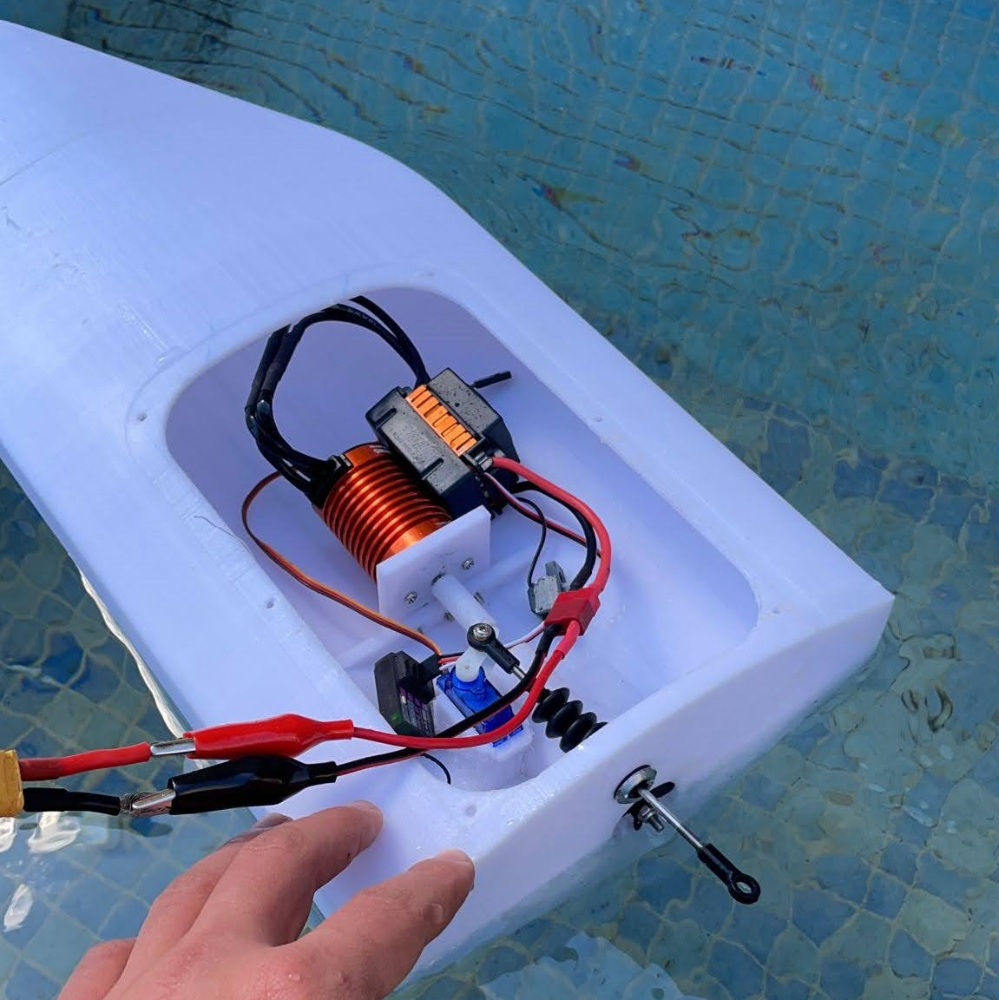
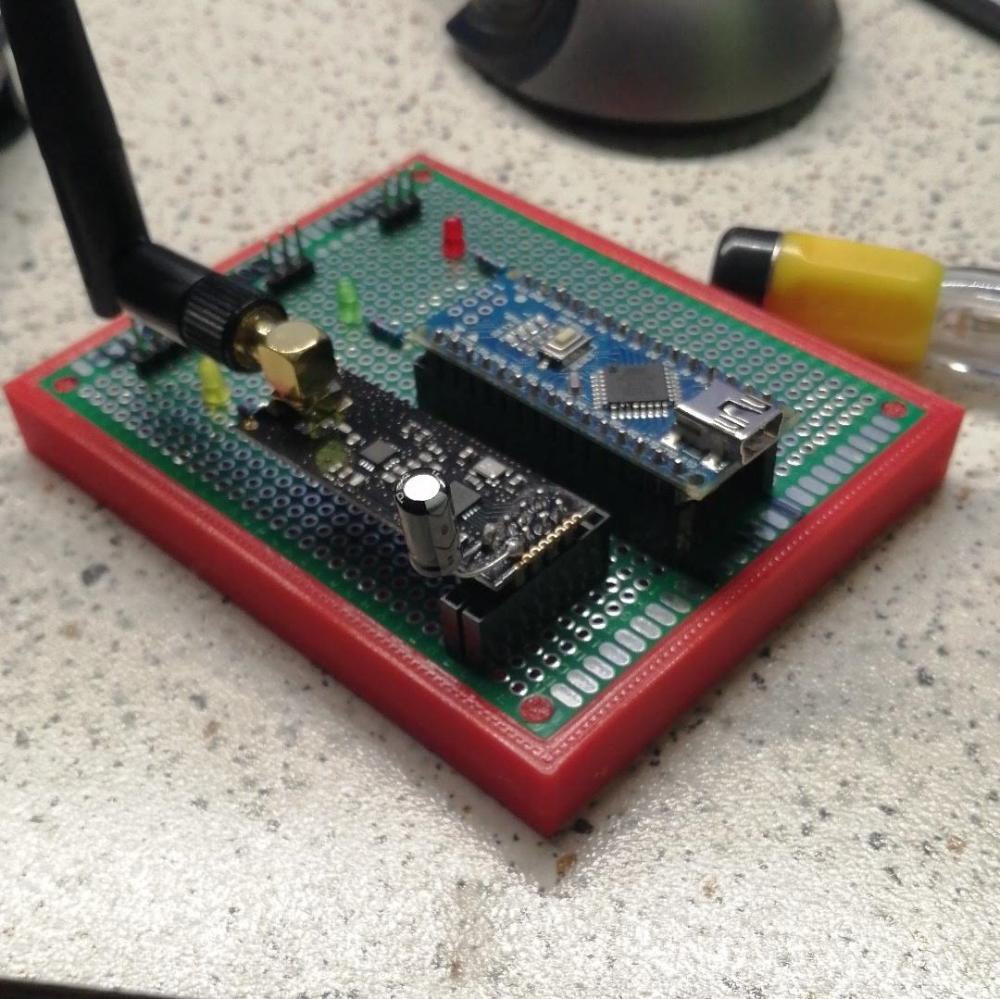

# Arduino-GPS-Boat
Radio Pilot 3D Printed Boat with Autopilot Mode, based on Arduino Nano Microcontroller

## Boat
The boat was 3D printed in PETG

## PCB
### First Version

### Second Version

## Radio Controller

